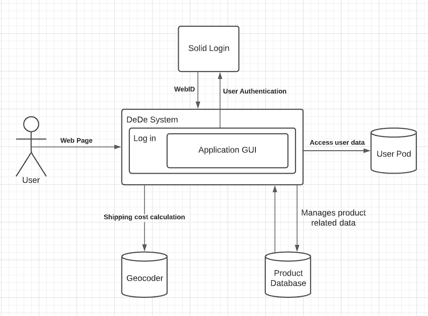

[[section-system-scope-and-context]]
== System Scope and Context

The application we have developed, DeDe, is an online retail system whose first priority is its clients privacy. In order to achieve this goal we use a new decentralized technology called SOLID where users store their data in POD's, hence they are in control of the information.

=== Business Context

When the user first arrives to the application, they will be able to browse and view the details of every product. In order to make a purchase, they must be logged in.

The login process takes place in the pod provider provided by the user and when finished it creates a session in the application which will be used to manage all internal logic.

Whenever the user wants to make an order, a series of steps will be followed; first, the list of products the client has chosen will be displayed and open to change, second the shipping information will be displayed and in case no valid information is found in the pod, the client will be able to fill it up.

Finally, when the user reaches the end of the checkout process an order summary will be displayed with the order information, total cost and shipping.

Once the order is placed, it is saved in the database and the user is given the option to see their orders or continue shopping.

image::images/business_context_diagram.png[]

=== Technical Context

The user will execute the application and will interact with the GUI in order to choose what products to buy. When the selection is done and the client wants to make an order the application will require them to Log in its Pod.

Following this, the backend will manage the necessary interactions with the user's POD and the product database in order to provide an estimated cost of delivery and compute the total cost of the order.

